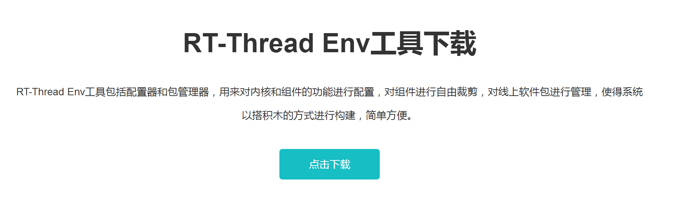
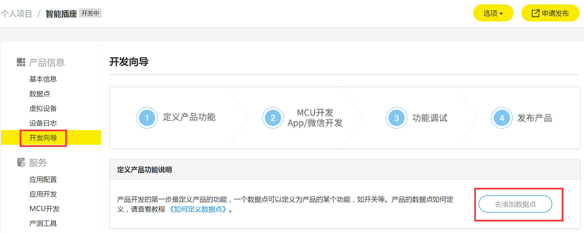

### 1. GAgent Package获取：
GAgent of Gizwits in RT-Thread是运行在RT-Thread上的机智云接入package，代码已开源在RT-Thread-packages/GAgent[https://github.com/RT-Thread-packages/GAgent](https://github.com/RT-Thread-packages/GAgent) 上。
#### 1.1 RT-Thread env工具：
* 强烈推荐使用RT-Thread env工具下载配置Package。env请在‘官网’->‘资源’->‘下载’[https://www.rt-thread.org/page/download.html](https://www.rt-thread.org/page/download.html) 处获取。  
  

* env使用手册请参照‘官网’->‘文档’->‘用户手册’->‘RT-Thread工具手册’[https://www.rt-thread.org/document/site/zh/5chapters/01-chapter_env_manual/#env](https://www.rt-thread.org/document/site/zh/5chapters/01-chapter_env_manual/#env)  
  

#### 1.2 Package下载：
* 运行env工具，进入RT-Thread已支持menuconfig配置的bsp目录，如stm32f429-apollo（也可自行配置Kconfig，方法如上文档），先运行`pkgs --upgrade`,成功后运行menuconfig命令。  
  

* 进入“RT-Thread online packages”菜单，选择“IoT -internet of things”菜单，进入后选中“GAgent： GAgent of Gizwits in RT-Thread”。GAgent有“example”和“debug”选项可配置，选中“example”，package内含GAgent运行demo，可通过finsh或msh启动；选中“debug”，将打印GAgent运行期间日志。这次我们同时选中这2个选项。
  

* GAgent用到的“IoT package”包括“WebClient”、“Paho MQTT”。这2个Packages已被默认选中。GAgent使用了2个“subscribe topic”，所以需要配置“Paho MQTT”中的“Max pahomqtt subscribe topic handlers”为2。
  

* GAgent同时还用到了“security package”中的“TinyCrypt”中的AES加解密，已默认选中。其他加密算法暂时没有用到，可手工关闭。
  

* 在env工具下输入`pkgs --update`下载Package，等待下载完成后，当前stm32f429-apollo目录下的packages下已经有GAgent及其他相关packages。


### 2. 运行前准备：
#### 2.1 开发者账号注册：
前往机智云开发者中心[https://dev.gizwits.com/zh-cn/developer/](https://dev.gizwits.com/zh-cn/developer/) 注册开发者账号
  

#### 2.2 产品创建与定义：  
2.2.1 产品创建：  
在开发者中心创建新产品页面创建新产品[https://dev.gizwits.com/zh-cn/developer/](https://dev.gizwits.com/zh-cn/developer/product/create)  
  

2.2.2 产品功能定义：  
2.2.2.1 在“开发向导”中定义数据点：  
  

2.2.2.2 创建并修改数据点：  
> 数据点创建/修改请参照机智云相关文档  

2.2.3 通讯协议下载：  
在开发向导页面下载当前定义产品的通讯协议文档，后续开发会用到。  
  
2.2.4. 获取产品基本信息：  
“Product_key”及“Product_Secret”是2个创建产品的唯一标示，在GAgent Package需要在初始化时输入。   

#### 2.3 “机智云”APP下载：  
在“下载中心”->“开发与调试工具”下载“机智云Wi-Fi/移动产品调试APP”  
  


### 3. 运行GAgent：  
#### 3.1 GAgent example：  
* 如在menuconfig中选中“Enable GAgent Example”,在编译过程中会加入GAgent Package包中example目录下的gagent_cloud_demo.c。该文件完成GAgent初始化，可通过finsh/msh启动运行 
``` C
int gagent_cloud(void)
{
    int rc = RT_EOK;

    rt_memset(&gagent_param, 0, sizeof(gagent_param));
    //
    strcpy(gagent_param.product_key, DEMO_PRODUCT_KEY);
    strcpy(gagent_param.product_secret, DEMO_PRODUCT_KEY_SECRET);
    strcpy(gagent_param.mac, DEMO_MAC);
    gagent_param.read_param_callback = gagent_read_param;
    gagent_param.write_param_callback = gagent_write_param;
    gagent_param.recv_packet_callback = gagent_recv_packet;
    //
    gagent_cloud_start(&gagent_param);
    
    return rc;
}
#ifdef RT_USING_FINSH
MSH_CMD_EXPORT(gagent_cloud, gagent cloud demo);

FINSH_FUNCTION_EXPORT(gagent_cloud, "gagent cloud test");
#endif
```  

#### 3.2 GAgent流程
3.2.1 将新产品注册时候“product_key”和“product_secret”填入“gagent_param.product_key”和“gagent_param.product_secret”。  
3.2.2. “gagent_param.mac”填入当前产品的mac地址，每个产品下的mac地址不能重复。  
3.2.3. 分别设置“read_param_callback”、“write_param_callback”回调函数，分别对应“读参数”、“写参数”；这2个回调函数必须实现正确的参数读取与写入。  
``` C
int gagent_read_param(struct gagent_config *param, rt_uint32_t len)
{
    /* read param */
#ifdef RT_USING_DFS
    int fd;

    fd = open("/sdcard/demo", O_RDONLY, 0);
    if(fd >= 0)
    {
        read(fd, param, len);
        close(fd);
    }
    else
        return -RT_EOK;
#endif
    return RT_EOK;
}

int gagent_write_param(struct gagent_config *param, rt_uint32_t len)
{
    /* write param */

    rt_kprintf("mac:%s", param->mac);
    rt_kprintf("did:%s", param->did);
    rt_kprintf("passcode:%s", param->passcode);
    rt_kprintf("pk:%s", param->pk);
    rt_kprintf("pk_secret:%s", param->pk_secret);
    rt_kprintf("hard_version:%s", param->hard_version);
    rt_kprintf("soft_version:%s", param->soft_version);
    
#ifdef RT_USING_DFS
    int fd;

    fd = open("/sdcard/demo", O_WRONLY | O_CREAT |O_TRUNC | O_BINARY, 0);
    if(fd >= 0)
    {

        write(fd, param, len);
        close(fd);
    }
#endif
    return RT_EOK;
```

3.2.4. 设置“recv_packet_callback”回调函数，该回调为APP下发数据包处理函数。  
1. 数据包协议请参照“2.2.4通讯协议文档”。  
2. 设备收到APP下发“ACTION_CONTROL”命令完成处理后，需使用“ACTION_REPORT_STATUS”同步状态。  
3.2.5. 调用“gagent_cloud_start”启动GAgent。  

#### 3.3 设备主动上报：  
设备主动上报使用“gagent_cloud_send_packet”函数。  

#### 3.4 错误处理:
3.4.1